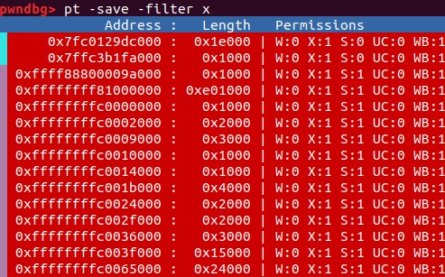
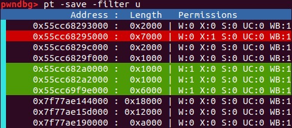
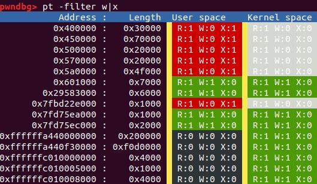
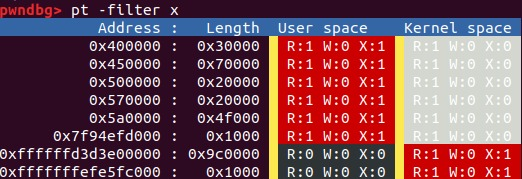

# gdb-pt-dump

`gdb-pt-dump` is a gdb script to parse a guest page table and dump it to stdout in a pretty way.
Although this is also possible via `monitor info mem`, the QEMU monitor provides less and sometimes incorrect information, and does not handle efficiently cases when many small pages are mapped.

## Features

* Dumping a page from a specific guest physical address.
* Merging semantically-similar contiguous memory.
* Provide detailed architectural information: writeable, executable, U/S, cacheable, write-back.
* Cache collected information for future filtering and printing.
* Filter page table information.

## How to use

The script is standalone but I hope that it eventually makes it way into `pwndbg` and/or `gef`.

For now, do `source PATH_TO_PT_DUMP/pt.py`.

For details, just do `help pt` in gdb.

## Examples

## Possible issues

Old QEMU versions seem to not provide access to privileged registers like cr3.
Thus, the page table address would need to be retrieved in some other way.

## Supported architectures

Only `x86-64` and `aarch64` supported.
There are still some todos left for `aarch64`.
